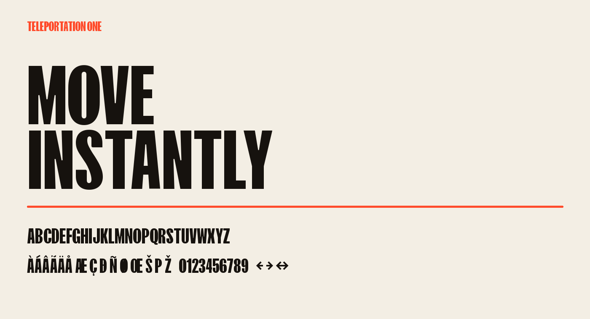

# Teleportation One



Teleportation One is a bold, all-caps display typeface built for speed,
impact, and dependable legibility. Lowercase text uses the same energetic
capital forms, making the family especially effective for headlines, labels,
posters, and compact interface moments.

The family contains one static style, published as Regular under Google Fonts'
single-weight naming convention. It supports the complete
Google Fonts Latin Core glyph set, including Western and Central European
languages, combining marks, currency symbols, mathematical operators, and
typographic punctuation.

## Build

Create a Python virtual environment, install the pinned dependencies, and run
the build script:

```sh
python3 -m venv .venv
. .venv/bin/activate
pip install -r requirements.txt
./build.sh
```

The build reads `sources/TeleportationOne-Regular.ufo` and writes
`fonts/ttf/TeleportationOne-Regular.ttf`.

## Quality assurance

With the dependencies installed, run:

```sh
./scripts/check.sh
```

The checks cover UFO validity, OpenType sanitization, Google Fonts Latin Core
coverage, and the FontBakery Google Fonts profile.

## License and copyright

Teleportation One is licensed under the SIL Open Font License, Version 1.1,
with no Reserved Font Names. Ryan Oksenhorn is the sole designer, author, and
copyright holder. See `OFL.txt`, `AUTHORS.txt`, and `COPYRIGHT.md`.
